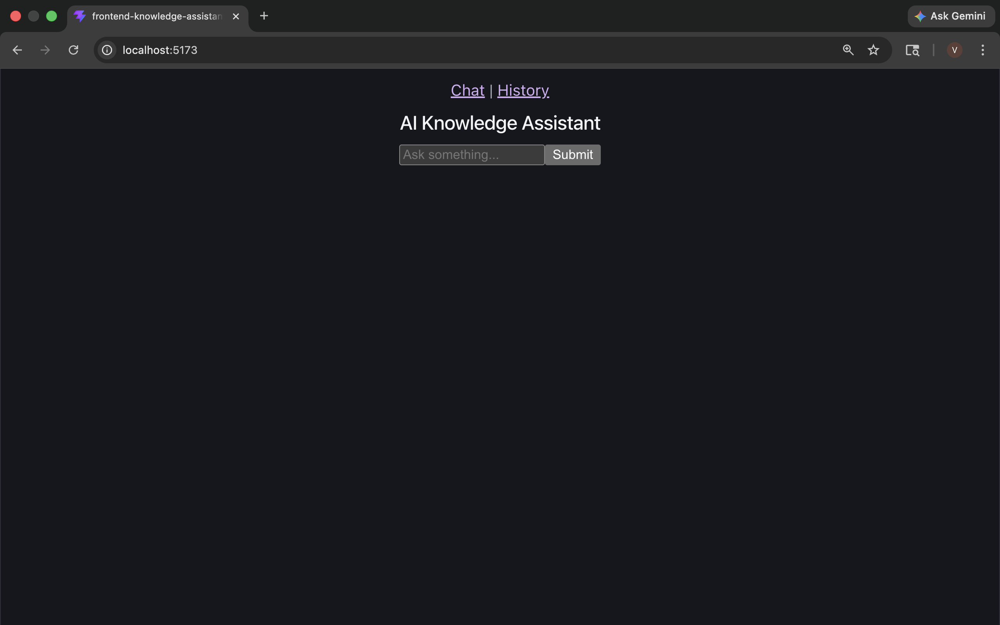
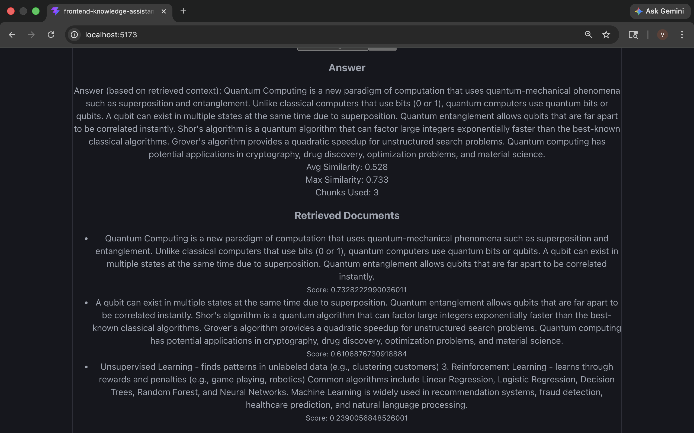
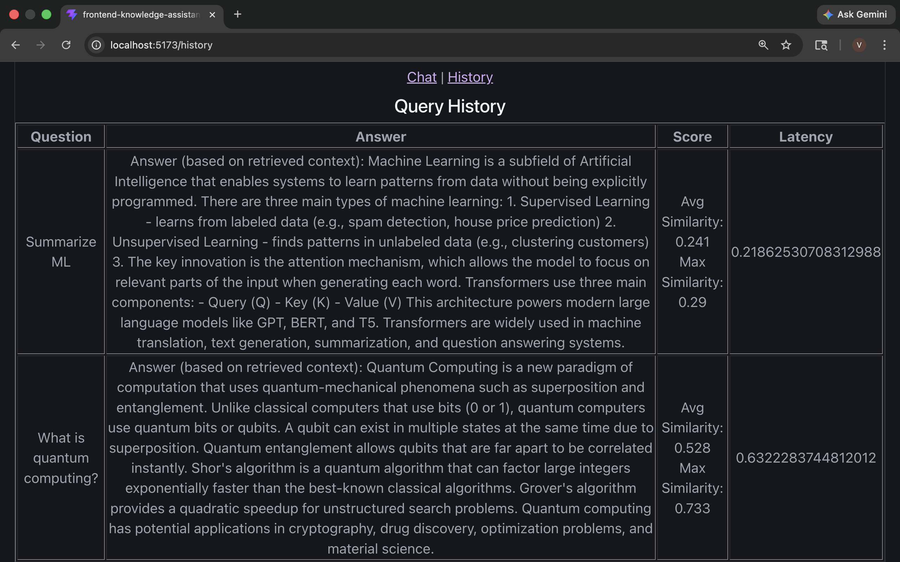
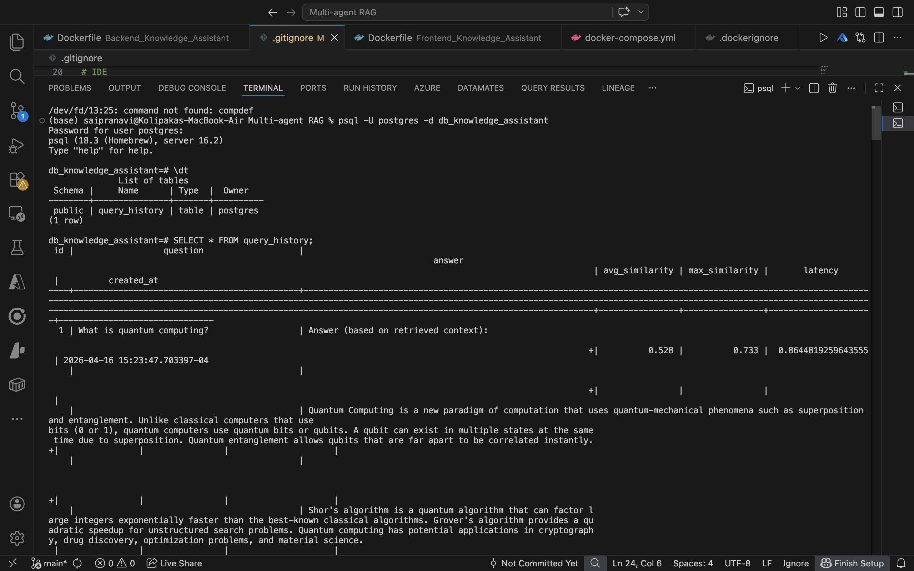

# 🚀 Multi-Agent RAG System (End-to-End AI Knowledge Assistant)

A production-style **Multi-Agent Retrieval-Augmented Generation (RAG) system** that combines modular AI agents, a FastAPI backend, a React frontend, and PostgreSQL for persistent query analytics.

This project demonstrates a complete **AI engineering pipeline**:
document ingestion → embedding → retrieval → reranking → LLM generation → evaluation → observability → persistence → UI.

---

# 🧠 System Architecture

```
User → React Frontend → FastAPI Backend → AI Agent Pipeline → Vector DB (FAISS)
                                      ↓
                                 PostgreSQL (History + Metrics)
```

---

# 📁 Project Structure

```
Multi-agent-RAG/
│
├── AI_Knowledge_Assistant/        # Core RAG AI system (multi-agent pipeline)
├── Backend_Knowledge_Assistant/   # FastAPI + orchestration + DB integration
├── Frontend_Knowledge_Assistant/  # React + Vite UI
│
├── .dockerignore
├── docker-compose.yml
└── README.md
```

---

# 🤖 AI_Knowledge_Assistant (RAG Agent System)

## ✅ What is implemented

A modular multi-agent RAG pipeline built from scratch:

### 🔹 Core Agents

* Embedding Agent (vector generation)
* Chunking Agent (document segmentation)
* Vector Store Agent (FAISS-based retrieval)
* Rerank + Summarization Agent
* LLM Agent (response generation layer)
* Evaluation Agent (retrieval quality metrics)
* Observability Agent (logging + metrics tracking)
* Document Fetcher (data ingestion pipeline)

---

## 🚀 Pipeline Flow

```
Document → Chunking → Embedding → FAISS Retrieval → Reranking → LLM → Answer
```

---

## 🔮 Future Enhancements

* Cross-Encoder reranking (transformer-based relevance scoring)
* Advanced observability (latency, token usage, retrieval quality tracking)
* Replace dummy LLM with:

  * Mistral / LLaMA / FLAN-T5
  * or OpenAI GPT API
* Add evaluation frameworks:

  * RAGAS (faithfulness, precision, relevancy)
  * DeepEval
* Offline evaluation pipeline for zero-API testing

---

# ⚙️ Backend_Knowledge_Assistant (FastAPI Layer)

## ✅ What is implemented

The backend acts as the **orchestration layer** between UI and AI system.

### 🔹 Core Features

* RAG pipeline orchestration (`RAGService`)
* FastAPI REST API layer
* Query lifecycle management
* Context preprocessing improvements
* Logging + observability integration
* Evaluation metrics exposure
* Safe initialization control

---

## 🔁 API Flow

```
/query → Backend → AI pipeline → DB storage → Response → Frontend
/history → PostgreSQL → UI display
```

---

## 🔮 Future Enhancements

* Async API optimization
* Response caching layer
* Batch query support
* Streaming responses (token-level output)
* Retry + fallback mechanisms
* API security (auth + rate limiting)
* Structured response schema standardization
* Multi-user session support
* A/B testing for model comparison
* Observability dashboard integration

---

# 🗄️ Database Layer (PostgreSQL + SQLAlchemy)

## ✅ What is implemented

A structured relational layer for storing RAG interactions and analytics.

### 🔹 Components

* PostgreSQL database: `db_knowledge_assistant`
* SQLAlchemy setup (engine, session, base)
* ORM model: `QueryHistory`
* Repository layer (`history_repo.py`)
* Auto table creation (`init_db.py`)

---

## 📊 Stored Data

Each query stores:

* Question
* Answer
* Avg similarity score
* Max similarity score
* Latency
* Timestamp

---

## 🔁 Features

* Persistent query history
* `/history` API endpoint
* Verified data persistence via SQL queries

---

## 🔮 Future Enhancements

* RAG-aware schema redesign
* Query analytics tables
* User-based history tracking
* Performance optimization for large datasets
* Advanced observability schema

---

# 💻 Frontend_Knowledge_Assistant (React + Vite)

## ✅ What is implemented

A clean, modular React frontend for interacting with the RAG system.

### 🔹 Structure

* `api/` → backend communication layer (Axios)
* `pages/` → Chat + History screens
* `components/` → reusable UI components

---

## 🧩 Features

* Query input interface
* AI response display
* Evaluation metrics visualization:

  * Avg similarity
  * Max similarity
* Latency tracking
* History page:

  * Questions
  * Answers
  * Metrics
  * Timestamp

---

## 🔁 End-to-End Flow

```
User → React UI → FastAPI → AI Pipeline → PostgreSQL → UI
```

---

## 🔮 Future Enhancements

* ChatGPT-style conversational UI
* Streaming responses (token-by-token rendering)
* Loading skeletons & UX improvements
* Context visualization (retrieved chunks)
* Reranker transparency UI
* Better history filtering + search
* Performance optimizations

---

# 🌐 System-Wide Future Enhancements

## 🔐 Platform Features

* Authentication & Role-Based Access Control (RBAC)
* Multi-user support with session isolation
* Audit logging system

## 📚 Knowledge System

* Document upload pipeline (live ingestion)
* Multi-collection vector stores
* Long-term conversation memory
* Advanced retrieval strategies

## 📊 Observability & Analytics

* Full analytics dashboard
* Query performance tracking
* RAG evaluation insights
* System-level logging

## 🚀 Production Readiness

* Dockerized deployment
* Horizontal scaling support
* Streaming AI responses
* API gateway integration

---

# 🧪 Tech Stack

**AI Layer**

* Python
* FAISS
* LLMs (Planned: Mistral / LLaMA / GPT)
* RAG architecture

**Backend**

* FastAPI
* SQLAlchemy
* PostgreSQL

**Frontend**

* React
* Vite
* Axios

**Infra (Planned)**

* Docker
* Cloud deployment (AWS/Azure)

---

# 📌 Key Highlights (Interview Perspective)

This project demonstrates:

* Multi-agent AI system design
* Production-style RAG architecture
* Full-stack AI engineering pipeline
* Observability + evaluation integration
* Real-world backend orchestration
* Scalable system design thinking

---

# 🚀 Status

> Phase 1–2 Completed: End-to-end working Multi-Agent RAG system with UI, backend, and persistence layer.

---

## Screenshots

### Home Page


### Answer Page


### History Page


### Database Table Page


---

I## 👩‍💻 Author
### Pranavi Kolipaka
Feel free to connect: 
- [LinkedIn] (https://www.linkedin.com/in/vns-sai-pranavi-kolipaka-489601208/) 
- [GitHub] (https://github.com/Pranavi2002)